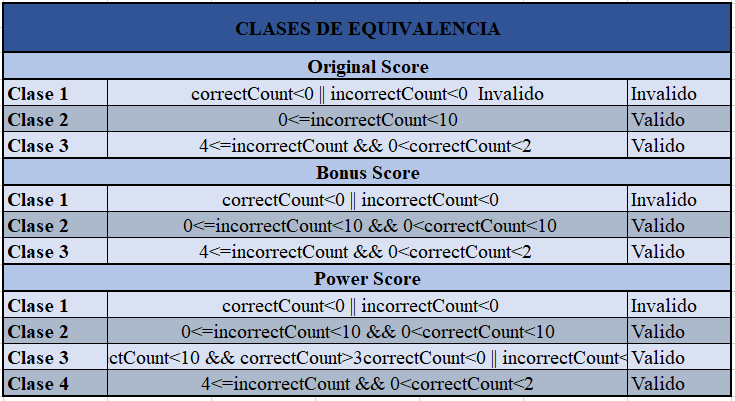

# **Laboratorio N°4**
## **CVDS-1**
### **Ciclos de Vida del Desarrollo de Software**


### Desarrollo Dirigido por Pruebas + DIP + DI + Contenedores Livianos


Para este taller se va a trabajar sobre el juego del ahorcado.

El sistema actual de puntuación del juego comienza en 100 puntos y va
descontando 10 puntos cada vez que se propone una letra incorrecta.

Algunos usuarios han propuesto diferentes esquemas para realizar la
puntuación, los cuales se describen a continuación:

* OriginalScore: 
    * Es el esquema actual, se inicia con 100 puntos.
    * No se bonifican las letras correctas.
    * Se penaliza con 10 puntos con cada letra incorrecta.
    * El puntaje minimo es 0.

* BonusScore: 
    * El juego inicia en 0 puntos.
    * Se bonifica con 10 puntos cada letra correcta.
    * Se penaliza con 5 puntos cada letra incorrecta.
    * El puntaje mínimo es 0
    
* PowerBonusScore:
    * El juego inicia en 0 puntos.
    * La $i-ésima$ letra correcta se bonifica con $5^i$.
    * Se penaliza con 8 puntos cada letra incorrecta.
    * El puntaje mínimo es 0
    * Si con las reglas anteriores sobrepasa 500 puntos, el puntaje es
      500.

Lo anterior, se traduce en el siguiente modelo, donde se aplica el
principio de inversión de dependencias:


### Parte I

1. Clone el proyecto (no lo descargue!).

```
	git clone https://github.com/PDSW-ECI/LigthwayContainer_DependencyInjection_Hangman.git	
```


   
2. A partir del código existente, se implementa sólo los cascarones del
   modelo antes indicado.
  
   
   
   
   
   
   
   
   

3. Especificación de los métodos calculateScore (de las tres
   variantes de GameScore)
   
   
   
   
   
   
   

4. Commit de lo realizado hasta ahora. Desde la terminal:
	

5. Actualizacion el archivo `pom.xml` incluyendo dependencias para la ultima versión de JUnit y la versión del compilador de Java a la versión 8 .

   

6. Teniendo en cuenta dichas especificaciones, en la clase donde se
   implementarán las pruebas (GameScoreTest), en los
   comentarios iniciales, especifique las clases de equivalencia para
   las tres variantes de GameScore, e identifique
   condiciones de frontera. 
   
   
   
7. Para cada clase de equivalencia y condición de frontera, implemente
   una prueba utilizando JUnit.

8. Haga commit de lo realizado hasta ahora. Desde la terminal:

	```bash		
	git add .			
	git commit -m "implementación pruebas"
	```
9. Realice la implementación de los 'cascarones' realizados anteriormente.
   Asegúrese que todas las pruebas unitarias creadas en los puntos anteriores
   se ejecutan satisfactoriamente.

10. Al finalizar haga un nuevo commit:

	```bash		
	git add .			
	git commit -m "implementación del modelo"
	```

11. Para sincronizar el avance en el respositorio y NO PERDER el trabajo, use
    el comando de GIT para enviar los cambios:

```bash	
	git push <URL Repositorio>	
```


### Parte II

Actualmente se utiliza el patrón FactoryMethod
que desacopla la creación de los objetos para diseñar un juego
de ahorcado (revisar createGUIUsingFactoryMethod en SwingProject, el
constructor de la clase GUI y HangmanFactoryMethod).

En este taller se va a utilizar un contenedor liviano ([GoogleGuice](https://github.com/google/guice)) el cual soporta la inyección de las dependencias.

1. Utilizando el HangmanFactoryMethod (MétodoFabrica) incluya el
   OriginalScore a la configuración.

Incorpore el Contenedor Liviano Guice dentro del proyecto:

* Revise las dependencias necesarias en el pom.xml.
Esta dependencia es la necesaria para poder utiizar de manera correcta google guice 


* Modifique la inyección de dependencias utilizando guice en lugar del
  método fábrica..
  
  Esto se realizo en el metodo main de la clase SwingProject
  
  En la clase HangmanFactoryServices se realizo la inyeccion de dependencias codificando los binds, quedando asi:

```
import hangman.model.Language;
import hangman.model.dictionary.HangmanDictionary;
import hangman.model.dictionary.FrenchDictionaryDataSource;
import hangman.model.dictionary.EnglishDictionaryDataSource;
import hangman.view.HangmanNoviolentoPanel;
import hangman.view.HangmanPanel;
import hangman.model.GameScore;
import hangman.model.OriginalScore;
import hangman.view.HangmanStickmanPanel;

public class HangmanFactoryServices extends com.google.inject.AbstractModule {

    @Override
    protected void configure() {
        /* Guice dependency injection */
        bind(GameScore.class).to(OriginalScore.class);
		bind(Language.class).to(English.class);
		bind(HangmanDictionary.class).to(EnglishDictionaryDataSource.class);
		bind(HangmanPanel.class).to(HangmanStickmanPanel.class);
    }

}
``` 

Adicionalmente es necesario modificar los comportamientos para que tuviera sentido dichas inyecciones

En OriginalScore
``` 
	private int puntaje;
	@Inject
	public OriginalScore(){
		puntaje = 100;	
	}
``` 

En BonusScore
``` 
	private int puntaje;
	
	@Inject
	public BonusScore(){
            puntaje = 0;	
	}
``` 

En PowerScore
``` 
private int puntaje;
	
	@Inject
	public PowerBonusScore(){
		puntaje = 0;	
	}
``` 

y finalmente en las tres clases de idioma, en sus respectivas clases
```
	@Inject
    public Spanish(){    
    }

	@Inject
    public English(){    
    }	
	
	@Inject
    public French(){    
    }
	

```
private int puntaje;
	
	@Inject
	public PowerBonusScore(){
		puntaje = 0;	

  
Por ultimo al compilarlo es posible evidenciar que esta funcional


##### Autores:
 * Santiago Buitrago
 * Andres Cubillos

[1]:https://maven.apache.org/

